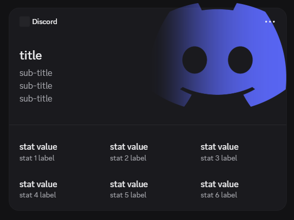
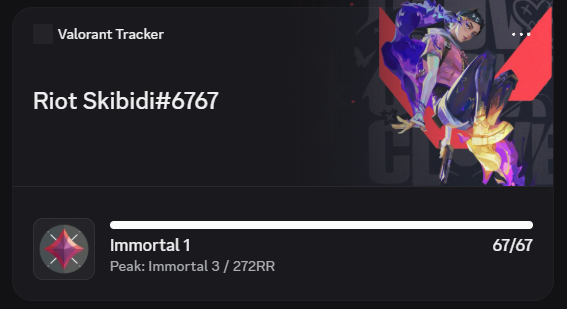
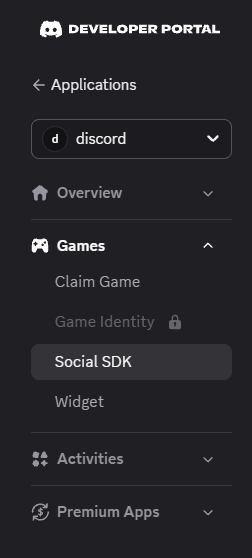
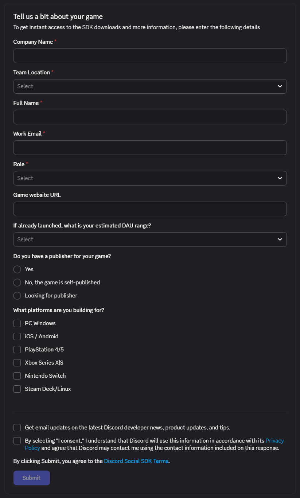
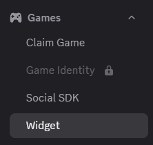
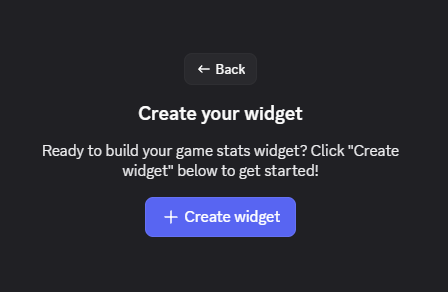
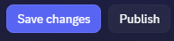
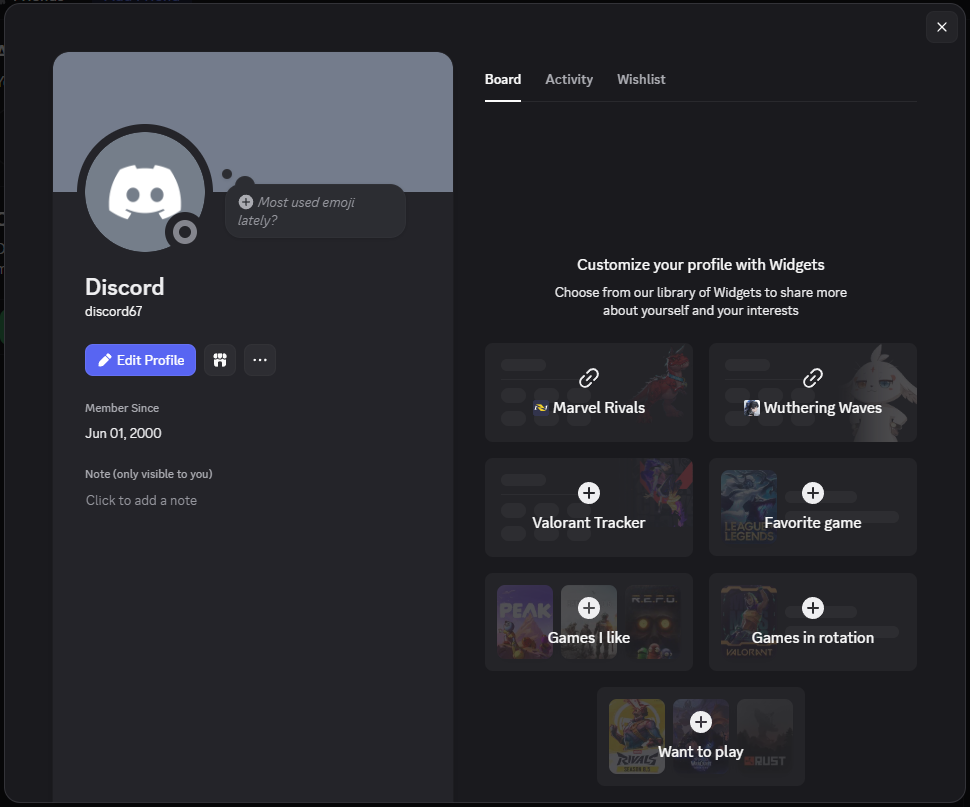
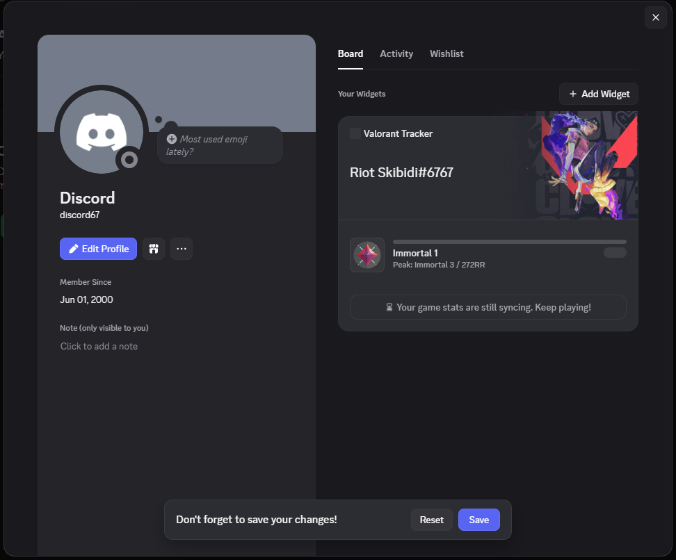

# Guide How to Create Discord Profile Widget

A step-by-step guide to creating, publishing, and enabling your own Discord profile widget.

> **Credit:** This guide is based on the excellent write-up at <https://chloecinders.com/blog/discord-widgets>.

Here are a couple of examples of what a finished profile widget can look like:

 

---

## Step 1 — Unlock the widget editor

1. Go to <https://discord.com/developers/applications>.
2. Open DevTools by pressing `F12` (or `Ctrl + Shift + I`).
3. Switch to the **Console** tab and paste the snippet below to enable the hidden widget configuration page:

```js
let _mods=webpackChunkdiscord_developers.push([[Symbol()],{},e=>e.c]);webpackChunkdiscord_developers.pop();
let findByProps=(...e)=>{for(let t of Object.values(_mods))try{if(!t.exports||t.exports===window)continue;if(e.every(e=>t.exports?.[e]))return t.exports;for(let r in t.exports)if(e.every(e=>t.exports?.[r]?.[e])&&"IntlMessagesProxy"!==t.exports[r][Symbol.toStringTag])return t.exports[r]}catch{}};
findByProps("getAll").getAll().find(e => e.getName() === "ApexExperimentStore").createOverride("2026-03-widget-config-editor", 1);
```

> **Note:** Don't refresh the page after running this — refreshing resets the override and you'll have to run the snippet again.

---

## Step 2 — Request Social SDK access

In the Developer Portal sidebar, open **Games → Social SDK**.



Fill out the access form and click **Submit**. Access is granted **instantly**, so you can continue right away.



---

## Step 3 — Create and publish your widget

1. Open the **Widget** page from the sidebar.

   

   > **Note:** If you don't see this button, run **Step 1** again to unlock the widget editor.

2. Click **+ Create widget** to create your first widget.

   

3. Customize it however you like.
4. Click **Save changes**, then click **Publish**.

   

---

## Step 4 — Configure OAuth2

1. Open the **OAuth2** page for your application.
2. Add a redirect URL under **Redirects** (it can be any valid URL).

---

## Step 5 — Authorize your bot

Open the authorization link below in your browser and authorize:

```http
https://discord.com/oauth2/authorize?client_id={bot_id}&response_type=token&scope=openid+sdk.social_layer
```

> Replace `bot_id` with your own application (bot) ID.

---

## Step 6 — Add your bot to the widget list

1. Open the Discord app or <https://discord.com/channels/@me>.
2. Open DevTools by pressing `Ctrl + Shift + I`.
3. In the **Console** tab, paste the snippet below to register your bot with the widget feature:

```js
let bot_id = "your_bot_id_here";
let _mods=webpackChunkdiscord_app.push([[Symbol()],{},e=>e.c]);webpackChunkdiscord_app.pop();
let findByProps=(...e)=>{for(let t of Object.values(_mods))try{if(!t.exports||t.exports===window)continue;if(e.every(e=>t.exports?.[e]))return t.exports;for(let r in t.exports)if(e.every(e=>t.exports?.[r]?.[e])&&"IntlMessagesProxy"!==t.exports[r][Symbol.toStringTag])return t.exports[r]}catch{}};
findByProps("getFeaturedApplicationIds").getFeaturedApplicationIds().push(bot_id);
```

> Replace `your_bot_id_here` with your own application (bot) ID.

After running the snippet, your bot appears in the widget list. Open your profile, choose your widget from the list, then click **Add Widget** or your bot name — it will show up under **Your Widgets**.

 

---

## Step 7 — Make your widget public

Send the request below to publish your profile so that everyone can see your widget.

Replace the placeholders before running:

- `{bot_id}` — your application (bot) ID.
- `{user_id}` — your Discord user ID.
- `{bot_token}` — your bot token.

**Windows (PowerShell):**

```powershell
Invoke-RestMethod -Method PATCH -Uri "https://discord.com/api/v9/applications/{bot_id}/users/{user_id}/identities/0/profile" `
  -Headers @{
    "Content-Type"  = "application/json";
    "Authorization" = "Bot {bot_token}";
    "User-Agent"    = "DiscordBot (https://github.com/discord/discord-api-docs, 1.0.0)"
  } -Body '{"username":"some_username","data":{"dynamic":[]}}'
```

**Linux / macOS (curl):**

```bash
curl -X PATCH "https://discord.com/api/v9/applications/{bot_id}/users/{user_id}/identities/0/profile" \
  -H "Content-Type: application/json" \
  -H "Authorization: Bot {bot_token}" \
  -H "User-Agent: DiscordBot (https://github.com/discord/discord-api-docs, 1.0.0)" \
  --data '{"username":"some_username","data":{"dynamic":[]}}'
```

---

## Done

Your Discord profile widget is now created, published, and visible to everyone. 🎉
